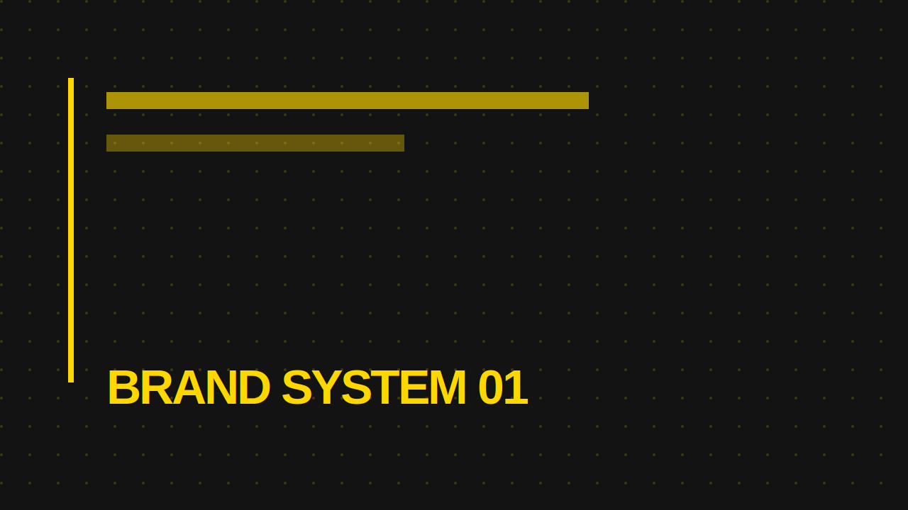

# Khemmawat Tantragool Portfolio Website — V2

Static responsive portfolio website for GitHub Pages.

## Main changes in V2

- Added `contact.html`
- `Get In Touch` now goes to the Contact page
- Added video modal popup: click a thumbnail to play YouTube video inside the website
- Work thumbnails are black and white by default, then become full color on hover
- Added contact draft form using `mailto:`
- Added 9-slot grids for Motion, Video, and Graphic
- Footer keeps: `© 2026 KHEMMAWAT TANTRAGOOL`

## Important playlist note

The website is static. It does not automatically pull YouTube playlist data live.

Motion playlist:
`https://youtube.com/playlist?list=PL8qV_1kI5UhFjftLzKUUPj3KzzkrMNKdZ`

Video playlist:
`https://youtube.com/playlist?list=PL8qV_1kI5UhFSuwuMUmAXmFncJOCbRw4F`

I prepared the portfolio grid using the video links and playlist-visible/search-visible items available during creation.  
For Video Editing, only 3 exact video URLs were available in the provided conversation, so the remaining slots reuse those IDs as editable placeholders.

## Contact

Email:
`khemmawat2539@hotmail.com`

YouTube:
`https://youtube.com/@taeoodmotion3968?si=3hNbAN0YJ-oHGJOD`

## How to change a video card

Find a card like this:

```html
<article class="work-card video-card" data-category="motion" data-title="sMMMart AI" data-youtube="iJ66kA3typ4">
  <button class="work-media js-open-video" type="button" data-video-id="iJ66kA3typ4" data-video-title="sMMMart AI">
    
```

Change the YouTube ID in 3 places:

1. `data-youtube="NEW_VIDEO_ID"`
2. `data-video-id="NEW_VIDEO_ID"`
3. `src="https://img.youtube.com/vi/NEW_VIDEO_ID/hqdefault.jpg"`

Change the title in 3 places:

1. `data-title="New Project Title"`
2. `data-video-title="New Project Title"`
3. `<span class="work-title">New Project Title</span>`

## How to get a YouTube ID

From:

```txt
https://youtu.be/TAZ3oMDy5-E
```

The ID is:

```txt
TAZ3oMDy5-E
```

From:

```txt
https://www.youtube.com/watch?v=TAZ3oMDy5-E
```

The ID is also:

```txt
TAZ3oMDy5-E
```

## How to change a graphic placeholder

Put your image in:

```txt
assets/thumbnails/
```

Then change this:

```html

```

To:

```html

```

## How the Contact form works

The Contact page form uses `mailto:`.

Flow:

```txt
Visitor fills form
→ clicks Contact Me
→ browser opens Outlook / Mail app
→ email draft is prepared
→ visitor presses Send manually
```

No backend is required. It works on GitHub Pages, but the visitor must have a mail app configured.

## GitHub Pages setup

1. Create a new GitHub repository.
2. Upload all files and folders from this package.
3. Go to `Settings` → `Pages`.
4. Under `Build and deployment`, choose:
   - Source: `Deploy from a branch`
   - Branch: `main`
   - Folder: `/root`
5. Open the generated GitHub Pages URL.

## File list

```txt
index.html
motion.html
video.html
graphic.html
contact.html
css/style.css
js/main.js
assets/thumbnails/
README.md
```
